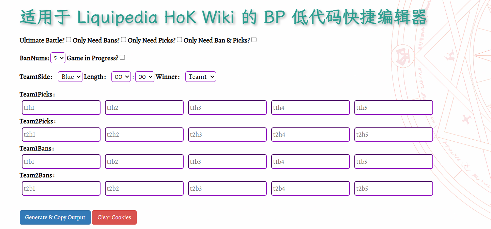

# 适用于Liquipedia HoK Wiki的BP低代码编辑器

本Demo实现了 ***[Liquipedia](https://liquipedia.net/honorofkings/)*** 的 *Ban&Picks* 格式化输出，降低了由于输出错误导致的增加检查成本，并提升了一定的编写效率。

#### 页面效果



#### 输出效果

##### 标准输出示例

``` javascript
        |team1side=blue|team2side=red|length=99:59|winner=1
        <!-- Hero picks -->
        |t1h1=agudo|t1h2=agudo|t1h3=agudo|t1h4=agudo|t1h5=agudo
        |t2h1=agudo|t2h2=agudo|t2h3=agudo|t2h4=agudo|t2h5=agudo
        <!-- Hero bans -->
        |t1b1=agudo|t1b2=agudo|t1b3=agudo|t1b4=agudo|t1b5=agudo
        |t2b1=agudo|t2b2=agudo|t2b3=agudo|t2b4=agudo|t2b5=agudo
```

##### 5个禁用

``` javascript
        |team1side=blue|team2side=red|length=00:00|winner=1
        <!-- Hero picks -->
        |t1h1=|t1h2=|t1h3=|t1h4=|t1h5=
        |t2h1=|t2h2=|t2h3=|t2h4=|t2h5=
        <!-- Hero bans -->
        |t1b1=|t1b2=|t1b3=|t1b4=|t1b5=
        |t2b1=|t2b2=|t2b3=|t2b4=|t2b5=
```

##### 4个禁用

``` javascript
        |team1side=blue|team2side=red|length=00:00|winner=1
        <!-- Hero picks -->
        |t1h1=|t1h2=|t1h3=|t1h4=|t1h5=
        |t2h1=|t2h2=|t2h3=|t2h4=|t2h5=
        <!-- Hero bans -->
        |t1b1=|t1b2=|t1b3=|t1b4=
        |t2b1=|t2b2=|t2b3=|t2b4=
```

##### 巅峰对决

``` javascript
        |team1side=blue|team2side=red|length=00:00|winner=1
        <!-- Hero picks -->
        |t1h1=|t1h2=|t1h3=|t1h4=|t1h5=
        |t2h1=|t2h2=|t2h3=|t2h4=|t2h5=
```

##### 只需要选择

```javascript
        <!-- Hero picks -->
        |t1h1=|t1h2=|t1h3=|t1h4=|t1h5=
        |t2h1=|t2h2=|t2h3=|t2h4=|t2h5=
```

##### 只需要4个禁用

```javascript
        <!-- Hero bans -->
        |t1b1=|t1b2=|t1b3=|t1b4=
        |t2b1=|t2b2=|t2b3=|t2b4=
```

##### 只需要5个禁用

```javascript
        <!-- Hero bans -->
        |t1b1=|t1b2=|t1b3=|t1b4=|t1b5=
        |t2b1=|t2b2=|t2b3=|t2b4=|t2b5=
```

##### 只需要禁用和选择

```javascript
        <!-- Hero picks -->
        |t1h1=|t1h2=|t1h3=|t1h4=|t1h5=
        |t2h1=|t2h2=|t2h3=|t2h4=|t2h5=
        <!-- Hero bans -->
        |t1b1=|t1b2=|t1b3=|t1b4=|t1b5=
        |t2b1=|t2b2=|t2b3=|t2b4=|t2b5=
```

##### 比赛正在进行

```javascript
        |team1side=blue|team2side=red|length=|winner=
        <!-- Hero picks -->
        |t1h1=|t1h2=|t1h3=|t1h4=|t1h5=
        |t2h1=|t2h2=|t2h3=|t2h4=|t2h5=
        <!-- Hero bans -->
        |t1b1=|t1b2=|t1b3=|t1b4=|t1b5=
        |t2b1=|t2b2=|t2b3=|t2b4=|t2b5=
```

#### 使用帮助

BP输入框支持提示词，本Demo支持了***Honor of Kings（包括国际服）***的绝大部分别名提示，您也可以通过修改***data.js***的***dataArray***数组进行修改。支持一个英雄设置多个**别名**，值对应如下：

| 名称  | 值           |
| ----- | ------------ |
| vulue | 最终的输出值 |
| text  | 提示词       |
| alias | 自定义的别名 |

您同样可以替换其他游戏的对应关系，或许您可以直接询问[大语言模型](https://ai.com/)将目标输出为对应格式获取。

```javascript
export const dataArray = [
    // 默认空值
    { "value": "", "text": "Null","alias":""},
    // 输出示例
    { "value": "agudo", "text": "阿古朵","alias":"aguduo"},
    { "value": "agudo", "text": "阿古朵","alias":"a gu duo"}
}
```

如果您计划在本地运行，推荐使用***VS Code***的***Live Server***插件部署此Demo，带来的诸多不便敬请谅解。

#### 最后

由于时间仓促，本Demo存在诸多不足，欢迎通过Issue向我提出！